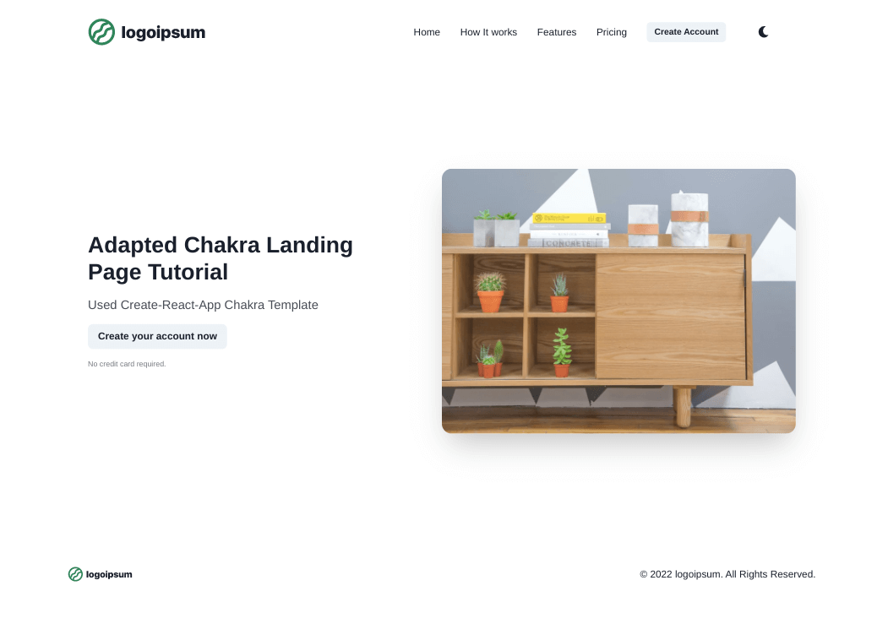
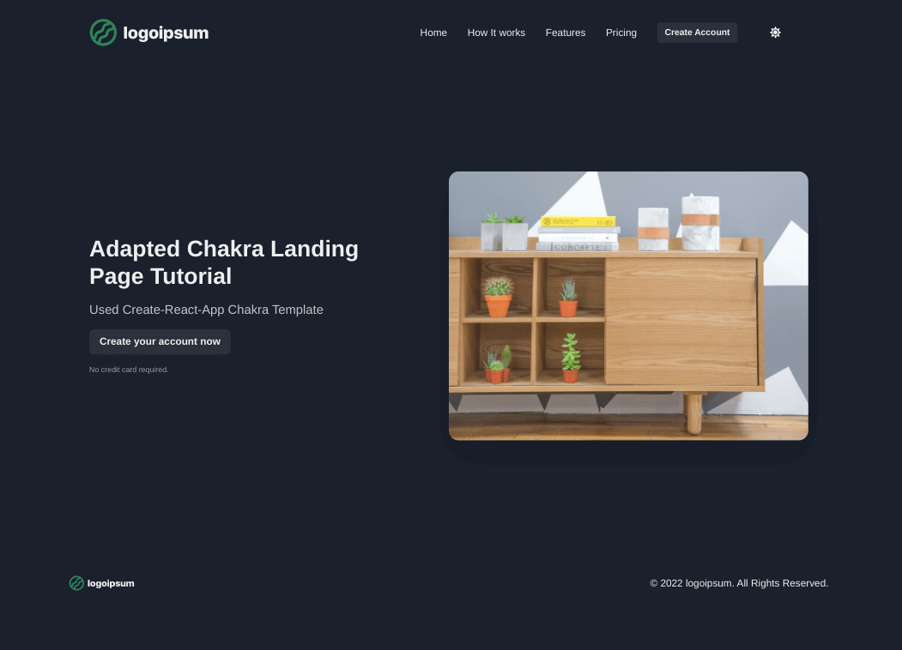

<h1 align="center">Chakra Landing Page</h1>

## Table of Contents

- [Overview](#overview)
  - [Built With](#built-with)
  - [Thoughts](#thoughts)
- [Useful Resources](#useful-resources)

## Overview

***

***

### Built With

- React
- Chakra UI
- React Router  

### Thoughts

- Used outdated tutorial to test out Chakra UI. 
- Upgraded from React Router 5 to 6.
- Used the create-react-app chakra template.
- Putting the CSS inside the components etc does bloat the code and can get in the way of reasoning about the code. 
- Almost have to indent and put all props on separate lines.
- Unsplash source was used for main image and it had to be replaced after Unsplash changed APIs.
- I added a random image from `lorempicker`.

## Useful Resources

- [Blog](https://raptis.wtf/blog/build-a-landing-page-with-chakra-ui-part-1/) - landing page with chakra
- [Chakra Templates](https://chakra-templates.dev/page-sections/footer) - Footer
- [Send Pulse](https://sendpulse.com/blog/landing-page-structure) - landing page structure
- [Blog](https://shaunhogg.com/insights/7-things-your-landing-pages-should-include/) - 7 things landing page should include
